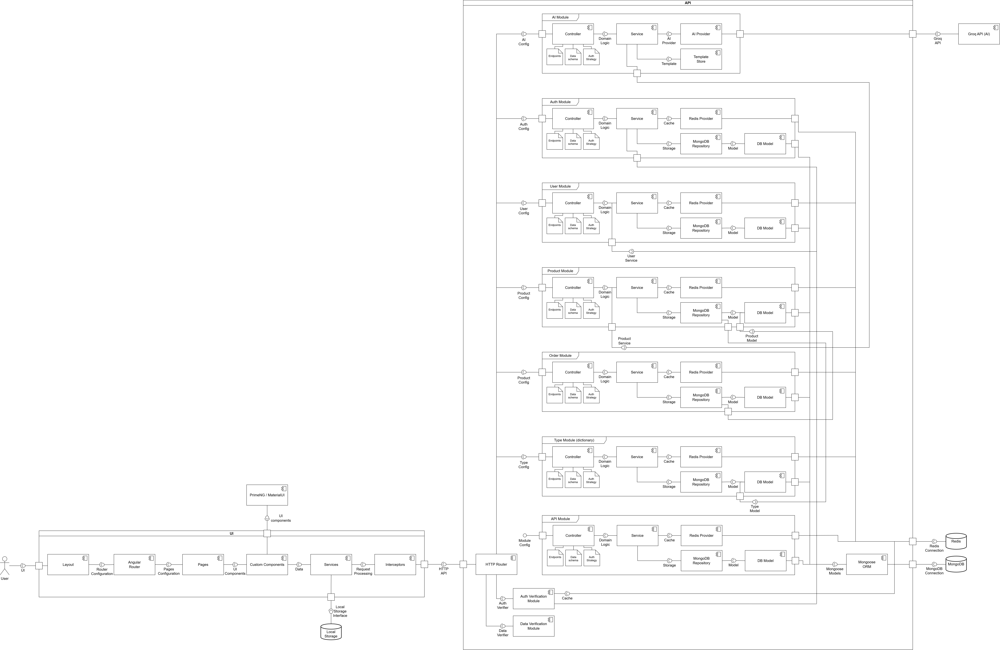

# Component Diagram of the Beer Shop

## Component Diagram

## Purpose of the Diagram

The component diagram represents a high-level architectural schema of the system, showing the main software components of the application and the relationships between them. This diagram serves the following purposes:

1. **Architecture Visualization** — provides a high-level view of the overall system structure
2. **Interaction Documentation** — shows how components interact with each other
3. **Development Planning** — helps the team understand which modules need to be created
4. **Communication** — ensures a common understanding of the system for all project participants

## Diagram Content

The diagram displays all key components of our beer shop:

- Backend services and their interconnections
- Database and cache
- Integrations with external services (including Google OAuth and AI service)
- Payment processing and order management components

## How to Use

When discussing architectural decisions or making changes to the system, refer to this diagram as the single source of truth about the application structure. Before making significant changes to the architecture, it is necessary to update this diagram and coordinate changes with the entire team.
