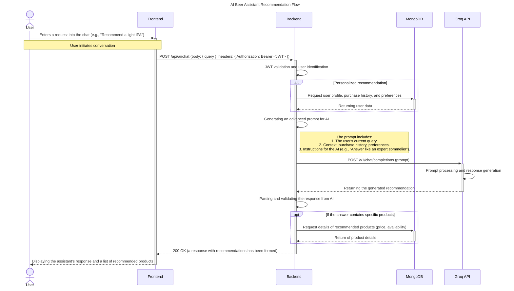

# Sequence Diagram: AI Assistant Interaction

This diagram illustrates the process of a user interacting with an AI assistant to receive personalized beer recommendations. The process includes authentication, data collection for personalization, querying an external AI service, and displaying the result.

