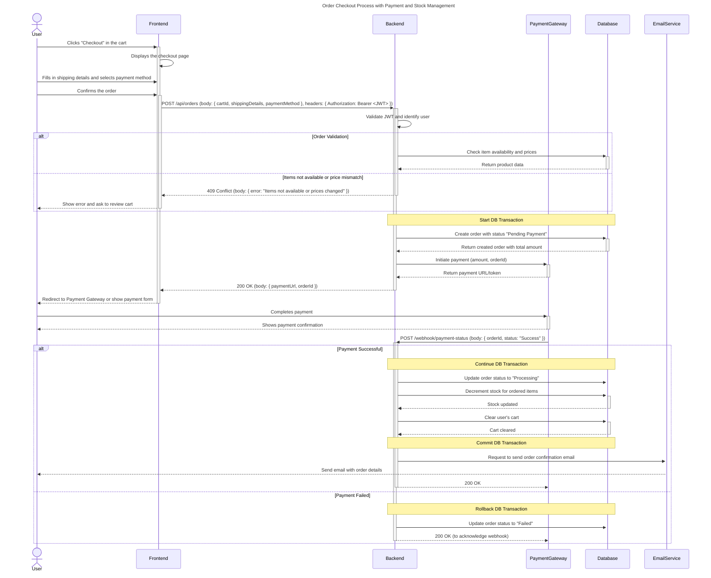

# Sequence Diagram: Order process

This diagram illustrates the checkout process, from the user's cart to order confirmation and notification.

```mermaid
sequenceDiagram
    actor User
    participant Frontend
    participant Backend
    participant PaymentGateway
    participant Database
    participant EmailService

    Title: Order Checkout Process with Payment and Stock Management

    User->>+Frontend: Clicks "Checkout" in the cart
    Frontend->>Frontend: Displays the checkout page

    User->>Frontend: Fills in shipping details and selects payment method
    User->>+Frontend: Confirms the order

    Frontend->>+Backend: POST /api/orders (body: { cartId, shippingDetails, paymentMethod }, headers: { Authorization: Bearer <JWT> })
    activate Backend

    Backend->>Backend: Validate JWT and identify user

    alt Order Validation
        Backend->>+Database: Check item availability and prices
        Database-->>-Backend: Return product data
    else Items not available or price mismatch
        Backend-->>-Frontend: 409 Conflict (body: { error: "Items not available or prices changed" })
        Frontend-->>-User: Show error and ask to review cart
    end

    note over Backend, Database: Start DB Transaction

    Backend->>+Database: Create order with status "Pending Payment"
    Database-->>-Backend: Return created order with total amount

    Backend->>+PaymentGateway: Initiate payment (amount, orderId)
    PaymentGateway-->>-Backend: Return payment URL/token

    Backend-->>-Frontend: 200 OK (body: { paymentUrl, orderId })

    Frontend-->>-User: Redirect to Payment Gateway or show payment form
    User->>+PaymentGateway: Completes payment
    PaymentGateway-->>-User: Shows payment confirmation

    PaymentGateway->>+Backend: POST /webhook/payment-status (body: { orderId, status: "Success" })
    activate Backend

    alt Payment Successful
        note over Backend, Database: Continue DB Transaction
        Backend->>+Database: Update order status to "Processing"
        Backend->>+Database: Decrement stock for ordered items
        Database-->>-Backend: Stock updated
        Backend->>+Database: Clear user's cart
        Database-->>-Backend: Cart cleared
        note over Backend, Database: Commit DB Transaction

        Backend->>+EmailService: Request to send order confirmation email
        EmailService-->>User: Send email with order details

        Backend-->>-PaymentGateway: 200 OK
    else Payment Failed
        note over Backend, Database: Rollback DB Transaction
        Backend->>+Database: Update order status to "Failed"
        Backend-->>-PaymentGateway: 200 OK (to acknowledge webhook)
    end
```
