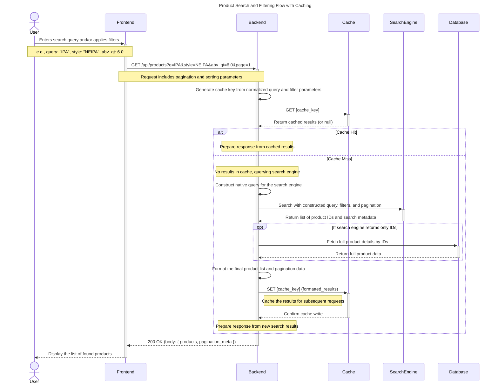

# Sequence Diagram: Product Search and Filtering

This diagram illustrates the process of a user searching for products and applying filters, including caching and interaction with a dedicated search engine.

