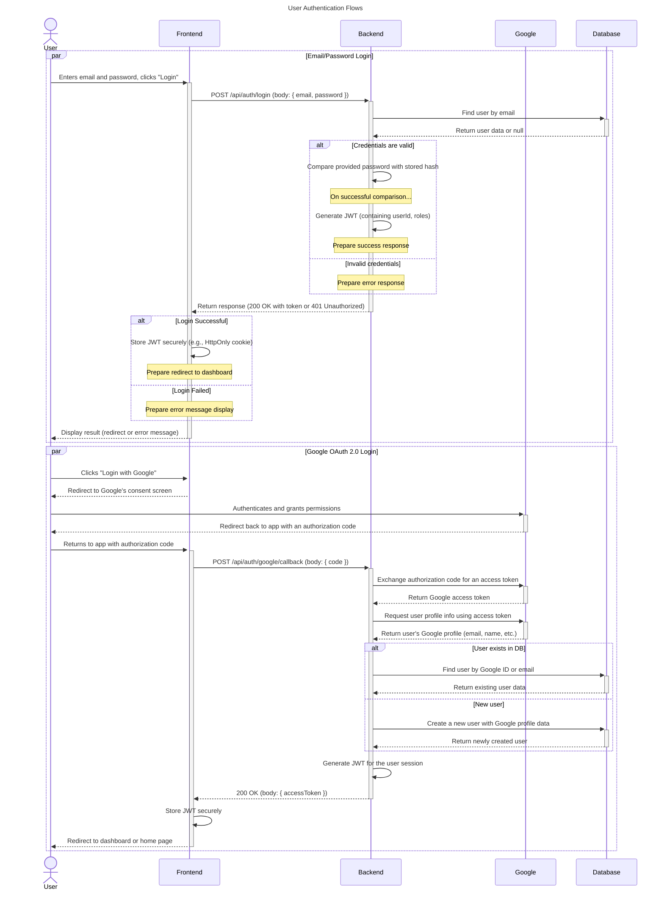

# Sequence Diagram: User Authentication

This diagram illustrates the two primary authentication flows: traditional email/password login and third-party OAuth 2.0 login (e.g., Google).

```mermaid
sequenceDiagram
    actor User
    participant Frontend
    participant Backend
    participant OAuthProvider as Google
    participant Database

    Title: User Authentication Flows

    par Email/Password Login
        User->>+Frontend: Enters email and password, clicks "Login"
        Frontend->>+Backend: POST /api/auth/login (body: { email, password })

        Backend->>+Database: Find user by email
        Database-->>-Backend: Return user data or null

        alt Credentials are valid
            Backend->>Backend: Compare provided password with stored hash
            note over Backend: On successful comparison...
            Backend->>Backend: Generate JWT (containing userId, roles)
            note over Backend: Prepare success response
        else Invalid credentials
            note over Backend: Prepare error response
        end

        Backend-->>-Frontend: Return response (200 OK with token or 401 Unauthorized)

        alt Login Successful
            Frontend->>Frontend: Store JWT securely (e.g., HttpOnly cookie)
            note over Frontend: Prepare redirect to dashboard
        else Login Failed
            note over Frontend: Prepare error message display
        end

        Frontend-->>-User: Display result (redirect or error message)
    end

    par Google OAuth 2.0 Login
        User->>+Frontend: Clicks "Login with Google"
        Frontend-->>User: Redirect to Google's consent screen

        User->>+OAuthProvider: Authenticates and grants permissions
        OAuthProvider-->>-User: Redirect back to app with an authorization code

        User->>+Frontend: Returns to app with authorization code
        Frontend->>+Backend: POST /api/auth/google/callback (body: { code })

        Backend->>+OAuthProvider: Exchange authorization code for an access token
        OAuthProvider-->>-Backend: Return Google access token

        Backend->>+OAuthProvider: Request user profile info using access token
        OAuthProvider-->>-Backend: Return user's Google profile (email, name, etc.)

        alt User exists in DB
            Backend->>+Database: Find user by Google ID or email
            Database-->>-Backend: Return existing user data
        else New user
            Backend->>+Database: Create a new user with Google profile data
            Database-->>-Backend: Return newly created user
        end

        Backend->>Backend: Generate JWT for the user session
        Backend-->>-Frontend: 200 OK (body: { accessToken })

        Frontend->>Frontend: Store JWT securely
        Frontend-->>-User: Redirect to dashboard or home page
    end
```
