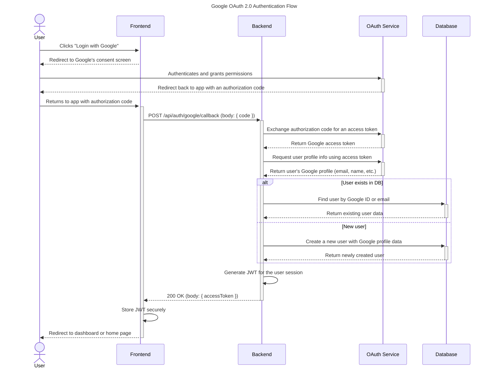

# Sequence Diagram: User Authentication

This diagram illustrates the authentication flow using Google OAuth 2.0.

```mermaid
sequenceDiagram
    actor User
    participant Frontend
    participant Backend
    participant OAuthProvider as OAuth Service
    participant Database

    Title: Google OAuth 2.0 Authentication Flow

    User->>+Frontend: Clicks "Login with Google"
    Frontend-->>User: Redirect to Google's consent screen

    User->>+OAuthProvider: Authenticates and grants permissions
    OAuthProvider-->>-User: Redirect back to app with an authorization code

    User->>+Frontend: Returns to app with authorization code
    Frontend->>+Backend: POST /api/auth/google/callback (body: { code })

    Backend->>+OAuthProvider: Exchange authorization code for an access token
    OAuthProvider-->>-Backend: Return Google access token

    Backend->>+OAuthProvider: Request user profile info using access token
    OAuthProvider-->>-Backend: Return user's Google profile (email, name, etc.)

    alt User exists in DB
        Backend->>+Database: Find user by Google ID or email
        Database-->>-Backend: Return existing user data
    else New user
        Backend->>+Database: Create a new user with Google profile data
        Database-->>-Backend: Return newly created user
    end

    Backend->>Backend: Generate JWT for the user session
    Backend-->>-Frontend: 200 OK (body: { accessToken })

    Frontend->>Frontend: Store JWT securely
    Frontend-->>-User: Redirect to dashboard or home page
```
